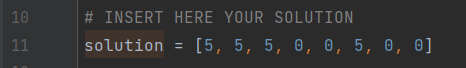

# CombinatorialVLSI
Authors:
- Enrico Pallotta
- Flavio Pinzarrone
- Giuseppe Tanzi  

Project work for the "Combinatorial Decision Making and Optimization" course of the Artificial Intelligence master's degree at University of Bologna.

## Visualizer.py
Allow you to visualize your model's solution.  
You have to insert your solution here:  
  
And set your instance number:  

