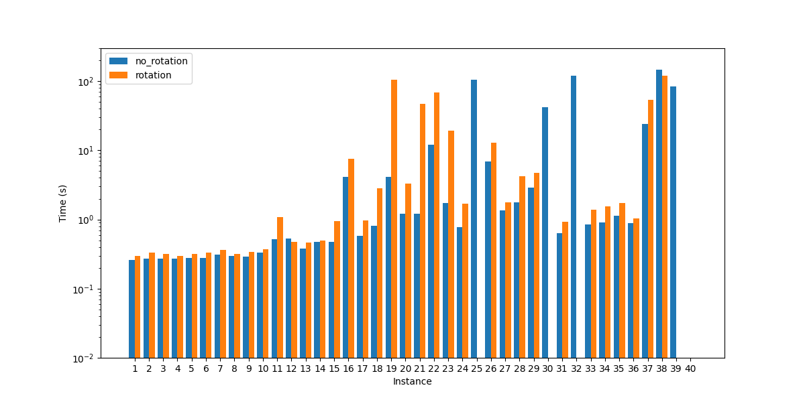

# Constraint programming
To run the solver you can simply execute the command: 
<code>python main.py -s cp</code>

For more instruction on the solver execution, refer to the main [README](../README.md).
Minizinc version required : 2.5.5

### Results with Chuffed (free search)

