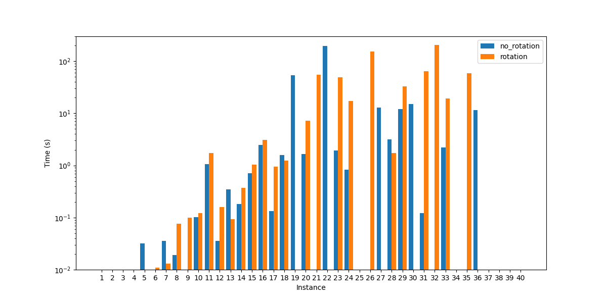
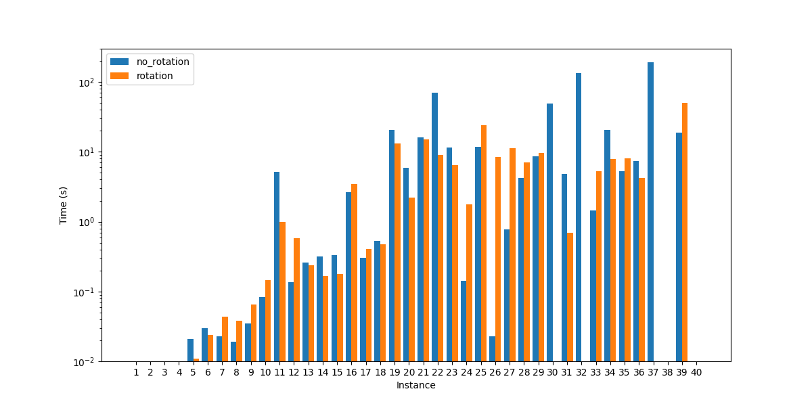

# Integer linear programming
A full description of the ideas and the implementation of this ILP model can be found in this [report](./lp_report.pdf).\
To run the solver you can simply execute the command: 
<code>python main.py -s lp</code>

For more instruction on the solver execution, refer to the main [README](../README.md).
### Gurobi solver results

### BOP solver results

