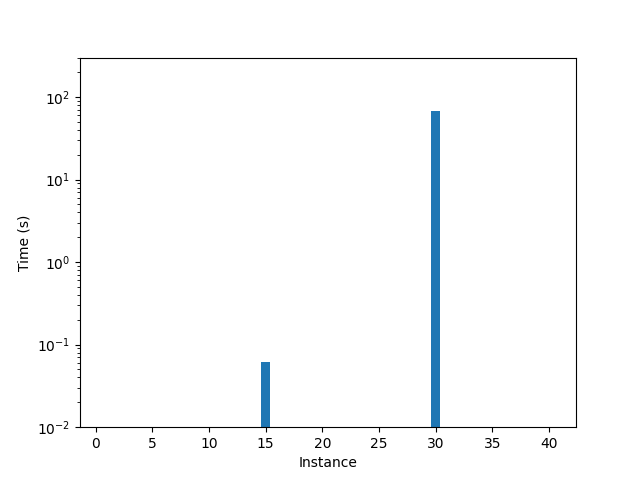

# SAT
A full description of the ideas and the implementation of this SAT model can be found in this [report](../sat_report.pdf).\
This is a SAT based approach to solve the 2-D Strip Packing Problem, it's a partial implementation of the paper by 
Takehide Soh et al. that you can find [here](https://www.researchgate.net/publication/220445013_A_SAT-based_Method_for_Solving_the_Two-dimensional_Strip_Packing_Problem).

To run the solver you can simply execute the command: 
<code>python main.py -s sat</code>

For more instruction on the solver execution, refer to the main [README](../../README.md).

### Results

