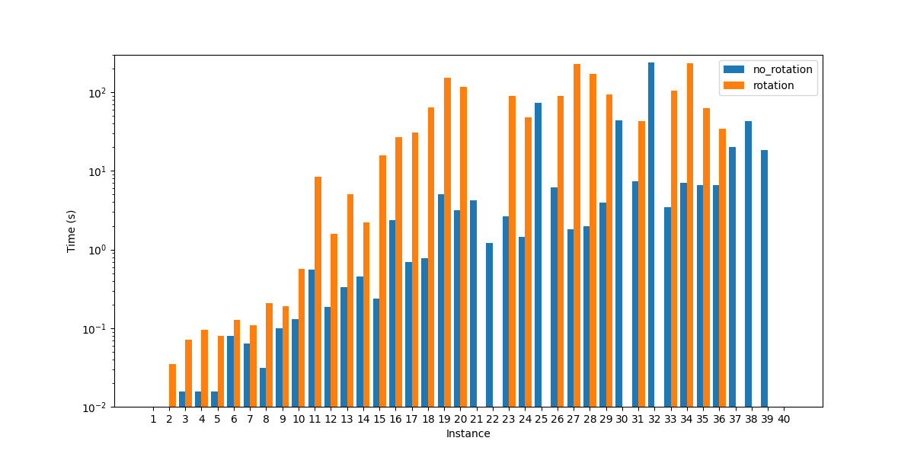

# Satisfiability modulo theory

To run the solver you can simply execute the command: 
<code>python main.py -s smt</code>

For more instruction on the solver execution, refer to the main [README](../README.md).

### Results obtained by Z3

